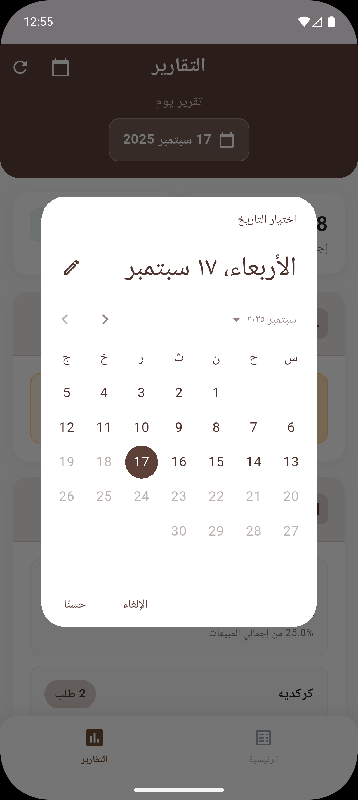
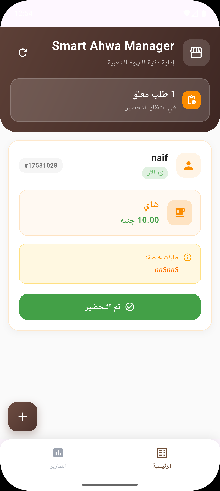
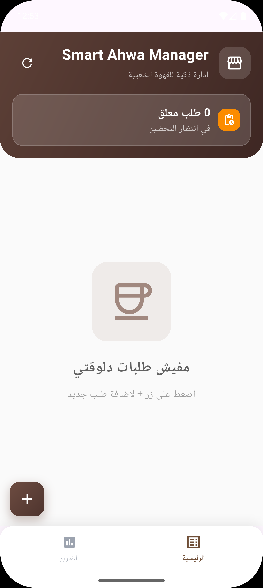
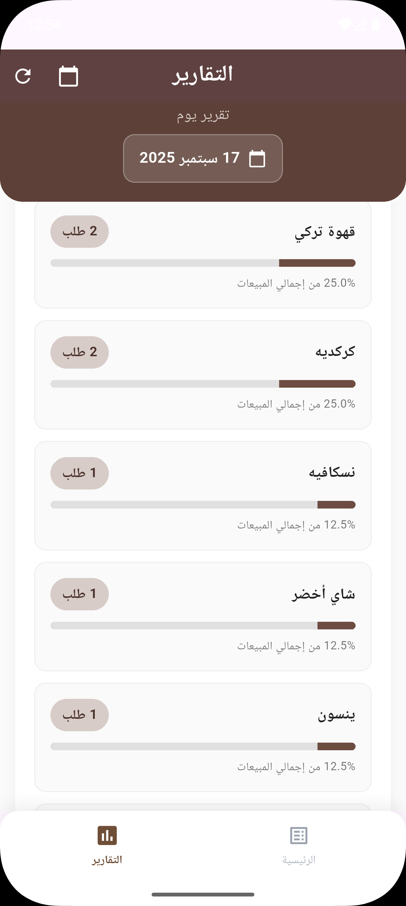
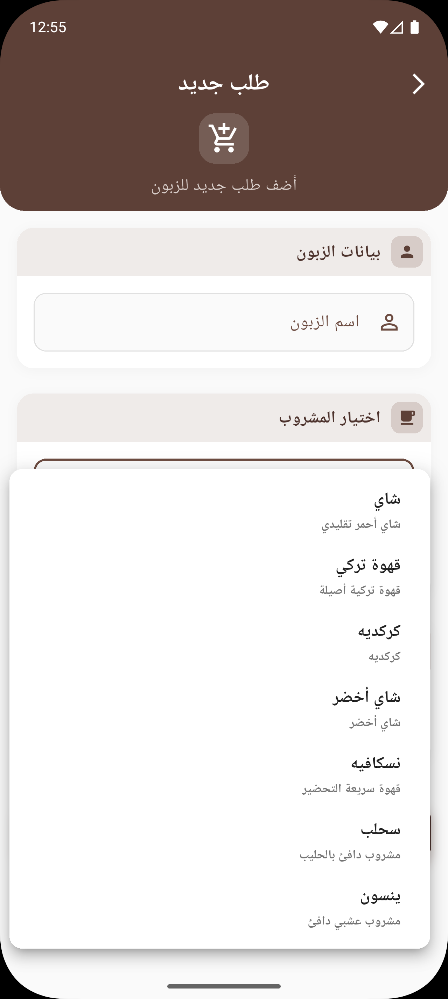
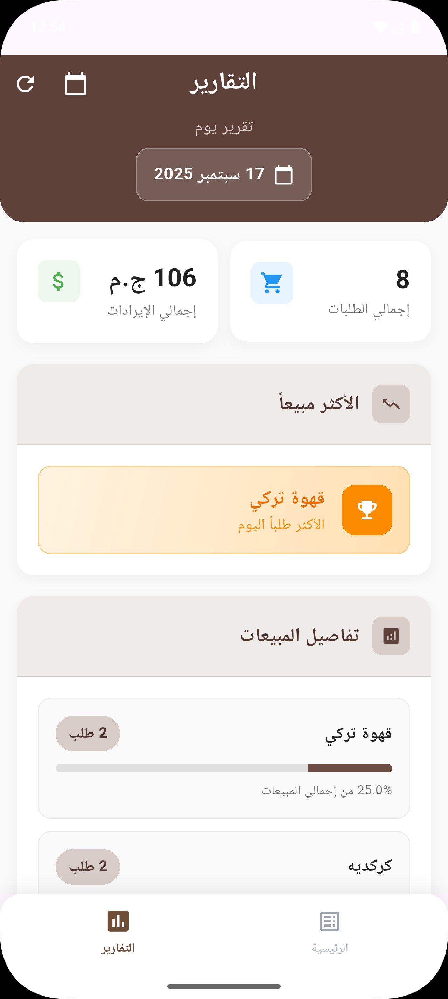
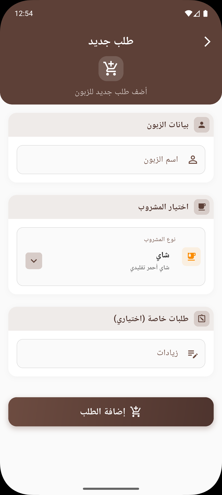

## Smart Ahwa Manager

A clean-architecture Flutter app demonstrating SOLID principles with a small cafe (ahwa) management domain: orders, pending orders dashboard, and daily reports. It uses BLoC for state management, get_it for DI, and a lightweight `Result<T>` to handle success/failure (no dartz).

### Features

- Dashboard with pending orders
- Add new order (animated, validated form)
- Generate daily report (summary and breakdown)
- Custom bottom navigation with 3 tabs
- Named route navigation via a centralized AppRouter
- Dependency Injection with `get_it`
- Clean Architecture (domain, data, presentation)
- SOLID-aligned use cases and repositories
- Custom generic `Result<T>` replacing `Either`

### Tech Stack

- Flutter 3.x (Dart 3)
- BLoC / flutter_bloc
- get_it (DI)
- shared_preferences (local persistence)

---

## Getting Started

### Prerequisites

- Flutter SDK installed and configured
- Dart SDK (bundled with Flutter)

### Install Dependencies

```bash
flutter pub get
```

### Run

```bash
flutter run
```

### Build

```bash
# Android (APK)
flutter build apk --release

# iOS
flutter build ios --release

# Web
flutter build web --release
```

---

## Project Structure

```text
solid_and_oop/
  lib/
    config/
      routing/
        app_router.dart              # Centralized routes (static const names)
      theme/
        app_colors.dart
        app_theme.dart
        text_styles.dart
    core/
      di/
        di.dart                      # get_it registrations
      errors/
        failures.dart                # Domain Failure base type
      usecases/
        usecase.dart                 # UseCase<Out, Params> → Result<Out>
      results/
        result.dart                  # Result<T>: Success<T> | FailureResult<T>
    features/
      ahwa_management/
        data/
          datasources/
            order_local_datasource.dart
          models/
            order_model.dart
          repositories/
            order_repository_impl.dart
        domain/
          entities/
            drink.dart
            order.dart
            report.dart
          repositories/
            order_repository.dart
          usecases/
            add_order.dart
            complete_order.dart
            get_pending_orders.dart
            generate_reports.dart
        presentation/
          cubit/
            ahwa_management_cubit.dart
            ahwa_management_state.dart
          pages/
            home_page.dart
            dashboard_page.dart
            add_order_page.dart
            reports_page.dart
          widgets/
            custom_bottom_navigation_bar.dart
            drink_dropdown.dart
            order_card.dart
            reports_widgets/
              summary_card.dart
            add_orders_widgets/
              custom_text_form_field.dart
              form_section.dart
              submit_button.dart
    main.dart
```

Guiding principles:

- Presentation uses BLoC/Cubit and pure Widgets only
- Domain is UI-agnostic (entities, use cases, contracts)
- Data implements repositories and persistence (mappers/models/datasources)

---

## Architecture Notes

### Result<T>

The app uses a minimal generic result type instead of `dartz`:

```dart
sealed class Result<T> {
  const Result();
  R fold<R>(R Function(Failure f) onFailure, R Function(T d) onSuccess);
}
class Success<T> extends Result<T> { final T data; const Success(this.data); }
class FailureResult<T> extends Result<T> { final Failure failure; const FailureResult(this.failure); }
```

Use cases and repositories return `Future<Result<Out>>`, and UI handles outcomes with `fold`.

### Use Cases

- Encapsulate one action each (e.g., `AddOrder`, `CompleteOrder`)
- Implement `Future<Result<Out>> call(Params)`

### Routing

Central `AppRouter` exposes static route names and an `onGenerateRoute`:

- `/` → `HomePage`
- `/add-order` → `AddOrderPage`
- `/reports` → `ReportsPage`

MaterialApp configuration:

```dart
onGenerateRoute: AppRouter.onGenerateRoute,
initialRoute: AppRouter.home,
```

### State Management

- `OrderCubit` manages orders, pending orders, and report generation
- UI subscribes with `BlocBuilder` and emits domain-driven states

### Dependency Injection

- `di.dart` registers data sources, repositories, and use cases via `get_it`
- `main.dart` creates and provides the `OrderCubit`

### Persistence

- `shared_preferences` stores serialized `OrderModel` list

---

## Development

### Linting

```bash
flutter analyze
```

### Tests

(Add tests as needed in `test/`.)

```bash
flutter test
```

### Localization

- Arabic-first labels and samples
- Extend via `assets/translations` and your preferred localization setup

### Theming

- Centralized in `config/theme/*` (colors, text styles, theme)

---

## Contributing

- Follow the existing architecture and code style
- Keep widgets declarative and side-effect free
- Prefer small, focused use cases
- Write clear commit messages and PR descriptions

## License

This project is provided as-is for learning and demonstration purposes.

---

## Screenshots (Mobile)

Images are stored at the repo root in `screenshots/`. The paths below are relative to this README:

<p align="center">
  
  
  
 
</p>

<p align="center">
  
  
</p>


<p align="center">
  
  
</p>
